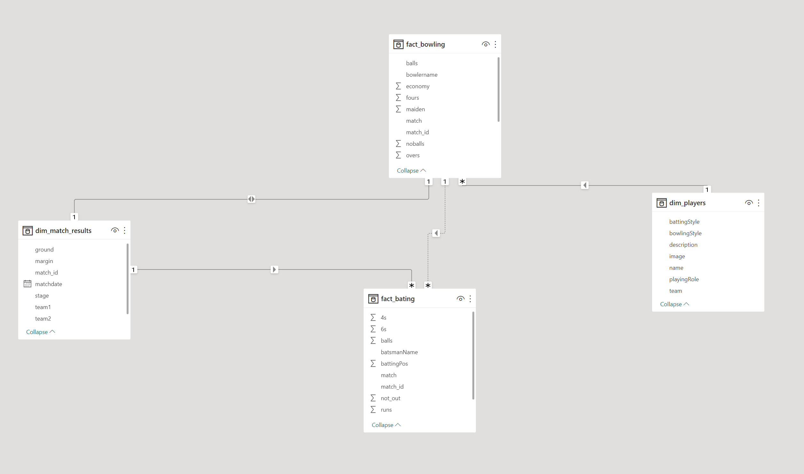

Schema for Cricket Database

The first dataset is a subset of real data from the Cricket game dataset. Source; https://codebasics.io/resources/data-analytics-project-for-beginners

I create ETL processes to get data from json files which are scrapped from ESPN website and created database which has star schema.

Purpose of the project make cricket data  to more understandable and make easy query and analyses the data .
Make dashboards and visulaizations to understand teams and players performance.

To run this files properly you need to have PostgreSQL software in your computer.

Fact Tables ; 
1. fact_bowling - records in the batting_summary.json file shows batting summary.

2. fact_bowling - records in the bowling_summary.json file shows bowling summary.

Dimension Tables; 
1. match_result - records in the match_result.json file shows match results.

2. players - records in the players_info.json file shows information about players.

5.time - timestamps of records in songplays broken down into specific units start_time, hour, day, week, month, year, weekday

Create Tables; sql_quaries.py contains CREATE and INSERT SQL codes to create tables and insert values to tables. 
create_tables.py by running this file it will create new database and create the necessary tables 
NOTE: you have to modify these parts ""host=127.0.0.1 dbname=cricket user=postgres password=user"" according to your environment

Build ETL Processes: Run etl.py develops ETL processes(reads and preprocess and insert them to table) for each table.

After creating database and its tables we import this datasets to POWER BI 

Data Modeling;
